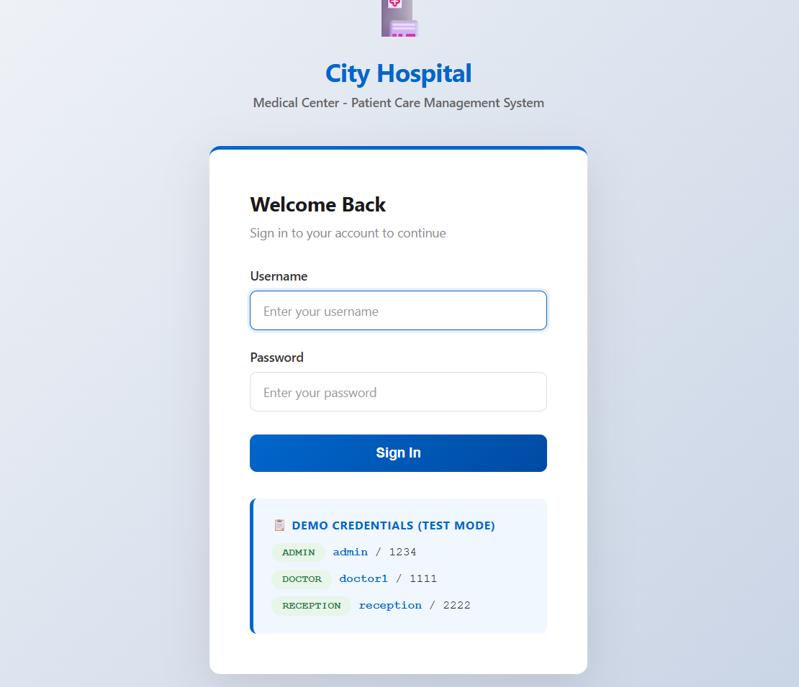
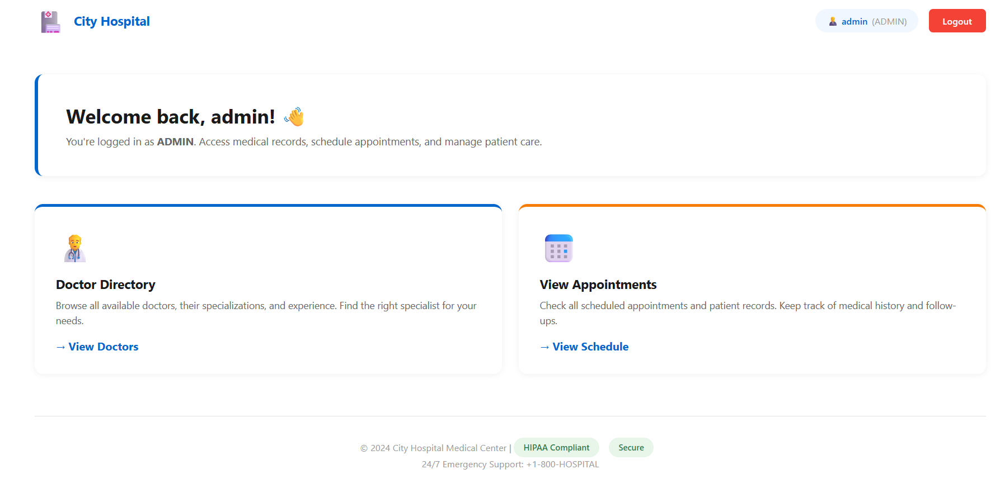
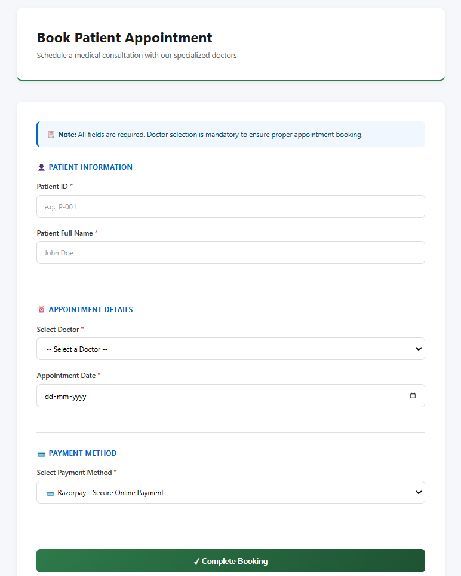
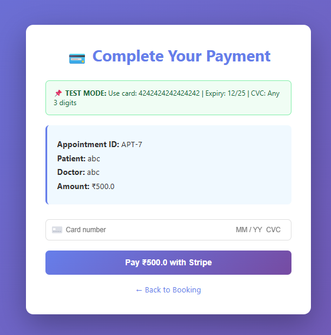
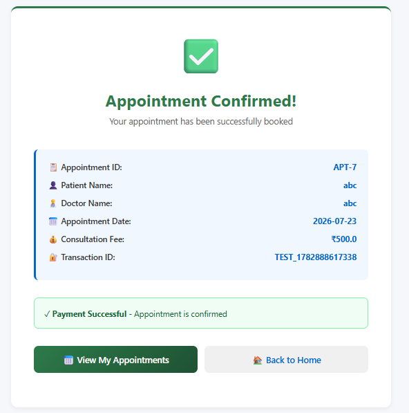

# 🏥 Hospital Management System (Web-Based with Authentication & Payment)

A modern **Hospital Management System** developed in **Java** using **Object-Oriented Programming (OOP)** principles. The project has evolved from a traditional CLI application into a **web-based hospital management solution** featuring secure authentication, role-based dashboards, appointment booking, payment simulation, and persistent data storage.

> **Note:** The current version includes a payment simulation workflow and is designed to support integration with real payment gateways such as **Stripe** or **Razorpay** in future releases.

---

## 📌 Project Overview

The Hospital Management System provides a centralized platform for managing hospital operations through an intuitive web interface.

It enables hospital staff to:

- Manage doctors
- Manage patients
- Schedule appointments
- Generate bills
- Authenticate users based on roles
- Process appointment payments (simulation)
- Maintain records with persistent file storage

The application is built using **Core Java**, **Java HTTP Server**, and **Object-Oriented Programming** concepts.

---

# ✨ Features

## 🔐 Authentication

- Secure Login System
- Role-Based Authentication
- Session Management
- Logout Functionality

---

## 👨‍💼 Admin

- View Dashboard
- Manage Doctors
- View Patients
- View Appointments
- Generate Bills
- Full Administrative Access

---

## 👨‍⚕️ Doctor

- Login to Dashboard
- View Assigned Patients
- View Appointments
- Access Patient Information

---

## 👩‍💼 Receptionist

- Register Patients
- Book Appointments
- View Doctors
- Generate Bills
- Payment Processing

---

## 📅 Appointment Management

- Patient Registration
- Doctor Selection
- Appointment Scheduling
- Appointment Confirmation
- Appointment History

---

## 💳 Payment Module

Current Version

- Payment Simulation
- Stripe Test Mode UI
- Payment Confirmation
- Transaction ID Generation
- Appointment Confirmation after Successful Payment

Future Version

- Stripe Integration
- Razorpay Integration
- Online Payment Verification
- Secure Payment Processing

---

## 💾 Data Management

Persistent storage using text files.

- doctors.txt
- patients.txt
- appointments.txt
- bills.txt

All records remain available even after restarting the application.

---

# 👥 User Roles

| Role | Username | Password | Permissions |
|------|----------|----------|-------------|
| Admin | admin | 1234 | Full System Access |
| Doctor | doctor1 | 1111 | View Appointments & Patients |
| Receptionist | reception | 2222 | Register Patients, Book Appointments & Billing |

---

# 🖥️ Screenshots

## 🔐 Login Page



---

## 📊 Admin Dashboard



---

## 📅 Appointment Booking



---

## 💳 Payment Page



---

## ✅ Appointment Confirmation



---

# ⚙️ Technologies Used

### Backend

- Java
- Core Java
- Java HTTP Server (`com.sun.net.httpserver.HttpServer`)

### Frontend

- HTML5
- CSS3
- JavaScript

### Programming Concepts

- Object-Oriented Programming
- Inheritance
- Polymorphism
- Encapsulation
- Abstraction

### Data Structures

- ArrayList

### Storage

- File Handling
- Scanner
- PrintWriter

---

# 🧠 OOP Design

```
                   Person (Abstract)
                   /               \
                  /                 \
             Doctor               Patient
                    \             /
                     \           /
                  Appointment
                        |
                     Bill
                        |
                    Hospital
```

---

# 🏗️ System Architecture

```
                    Browser
                        │
                        ▼
               HTTP Request
                        │
                        ▼
             Java HTTP Server
                        │
                        ▼
              Authentication
                        │
         ┌──────────────┼──────────────┐
         ▼              ▼              ▼
      Admin         Doctor      Receptionist
         │              │              │
         └──────────────┼──────────────┘
                        ▼
                   Hospital
                        │
      ┌─────────────────┼────────────────┐
      ▼                 ▼                ▼
  Doctors          Patients       Appointments
                        │
                        ▼
                    Billing
                        │
                        ▼
                 Payment Module
                        │
                        ▼
                 Confirmation Page
```

---

# 💳 Appointment Workflow

```
Login
   │
   ▼
Dashboard
   │
   ▼
Book Appointment
   │
   ▼
Select Doctor
   │
   ▼
Choose Date
   │
   ▼
Payment Page
   │
   ▼
Payment Success
   │
   ▼
Appointment Confirmation
```

---

# 📂 Project Structure

```
Hospital-Management-System/
│
├── src/
│   ├── Main.java
│   ├── WebApp.java
│   ├── Hospital.java
│   ├── Auth.java
│   ├── Person.java
│   ├── Doctor.java
│   ├── Patient.java
│   ├── Appointment.java
│   ├── Bill.java
│   └── ConsoleColors.java
│
├── data/
│   ├── doctors.txt
│   ├── patients.txt
│   ├── appointments.txt
│   └── bills.txt
│
├── images/
│   ├── login.png
│   ├── dashboard.png
│   ├── booking.png
│   ├── payment.png
│   └── confirmation.png
│
├── README.md
└── .gitignore
```

---

# 🚀 Getting Started

## Prerequisites

- Java JDK 17+
- Git

---

## Clone Repository

```bash
git clone https://github.com/yourusername/Hospital-Management-System.git
```

---

## Navigate to Project

```bash
cd Hospital-Management-System
```

---

## Compile Project

```bash
javac src/*.java
```

---

## Run Project

```bash
java -cp src Main
```

---

## Open Browser

```
http://localhost:8080
```

---

# 🔑 Demo Credentials

## Admin

```
Username : admin
Password : 1234
```

## Doctor

```
Username : doctor1
Password : 1111
```

## Receptionist

```
Username : reception
Password : 2222
```

---

# 💳 Payment Simulation

The project currently implements a secure payment simulation workflow.

### Booking Flow

```
Patient Registration
        │
        ▼
Doctor Selection
        │
        ▼
Appointment Booking
        │
        ▼
Payment Page
        │
        ▼
Transaction Generated
        │
        ▼
Appointment Confirmed
```

The payment module currently generates a simulated transaction ID for testing purposes and can be upgraded to support real payment providers.

---

# 🔒 Security Features

- Role-Based Authentication
- Session Validation
- Protected Routes
- Logout Functionality
- Payment Verification Workflow (Simulation)

---

# 📈 Future Enhancements

- ✅ Stripe Payment Gateway
- ✅ Razorpay Integration
- ✅ MySQL Database
- ✅ Patient Portal
- ✅ Email Notifications
- ✅ SMS Appointment Reminder
- ✅ Doctor Availability Calendar
- ✅ Medical Reports Upload
- ✅ Online Prescription
- ✅ Admin Analytics Dashboard
- ✅ PDF Bill Generation
- ✅ JWT Authentication
- ✅ Password Encryption
- ✅ REST API Support

---

# 🌟 Project Highlights

- Web-Based Hospital Management System
- Modern User Interface
- Role-Based Authentication
- Multi-Step Appointment Workflow
- Integrated Payment Simulation
- Object-Oriented Design
- Persistent File Storage
- Responsive Layout
- Easy to Extend
- Ready for Real Payment Gateway Integration

---

# 👨‍💻 Author

**Khairul Bashar**

**B.Tech Computer Science**

Hospital Management System Project

---

# 🤝 Contributing

Contributions are welcome.

1. Fork the repository
2. Create a feature branch
3. Commit your changes
4. Push the branch
5. Open a Pull Request

---

# ⭐ Support

If you found this project useful, please consider giving it a ⭐ on GitHub.

It helps others discover the project and motivates future improvements.